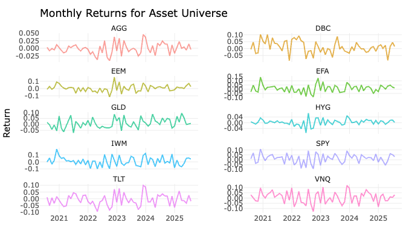
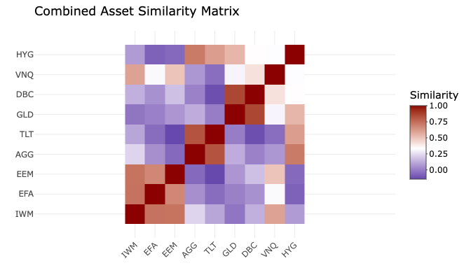
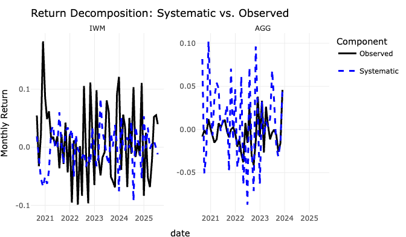
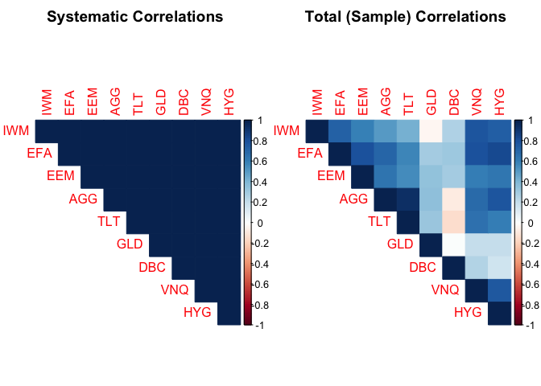
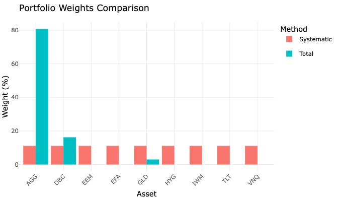

# Portfolio Optimization Using Mixed Models

## Executive Summary

This tutorial explores how mixed linear models from genomic prediction
can enhance portfolio optimization. The key insight is that just as
genomic models separate signal from noise in breeding values, we can use
similar techniques to extract stable, predictable relationships between
assets while filtering out transient market noise. This leads to more
robust portfolio allocations that perform better out-of-sample.

## Table of Contents

1.  [Motivation: Why Genomic Methods for Portfolios?](#motivation)
2.  [Theoretical Framework](#theoretical-framework)
3.  [Data and Setup](#data-and-setup)
4.  [Building the Mixed Model](#building-the-mixed-model)
5.  [Extracting Covariance Structures](#covariance-structures)
6.  [Portfolio Construction](#portfolio-construction)
7.  [Validation and Comparison](#validation)
8.  [Practical Implementation Guide](#implementation-guide)
9.  [Conclusions](#conclusions)

## 1. Motivation: Why Genomic Methods for Portfolios?

Traditional portfolio optimization faces a fundamental challenge: sample
covariance matrices are notoriously noisy, especially when the number of
assets is large relative to the observation period. This leads to
unstable portfolio weights that perform poorly out-of-sample.

In genomic prediction, researchers face a similar challenge: estimating
breeding values for thousands of genetic markers with limited phenotypic
observations. The solution? Mixed linear models that:

1.  **Borrow information** across related observations
2.  **Impose structure** through variance components
3.  **Shrink estimates** toward more stable values
4.  **Separate signal from noise** through random effects

Let’s explore how these same principles can revolutionize portfolio
construction.

### The Core Analogy

In genomics:

- **Breeding value** = Genetic potential (signal)
- **Environmental variance** = Non-heritable variation (noise)
- **Selection decisions** use breeding values
- **Performance prediction** uses total variance

In portfolios:

- **Systematic returns** = Factor-driven, persistent relationships
  (signal)
- **Idiosyncratic returns** = Asset-specific, transient shocks (noise)
- **Allocation decisions** should focus on systematic relationships
- **Risk assessment** must consider total variance

### Assumptions of the Mixed Model in Finance

When applying mixed models to financial data, we must be mindful of the
underlying assumptions:

- **Normality of Returns:** We assume that asset returns (or their
  residuals) are normally distributed. While monthly returns often
  exhibit “fat tails” (kurtosis), for the purpose of demonstrating the
  framework, we proceed with this assumption. In practice, one might use
  transformations or models that accommodate non-normality.
- **Stationarity:** We assume that the underlying statistical properties
  of the return series (like mean and variance) do not change over time.
  While this is rarely true in the long run, we assume it holds within
  our estimation window. The model’s use of time-based random effects
  helps capture some degree of non-stationarity.
- **Linearity:** The model assumes a linear relationship between the
  predictors (market factors) and the asset returns. This is a common
  starting point for factor models.

## 2. Theoretical Framework

### Traditional Mean-Variance Optimization

The classical Markowitz approach minimizes portfolio variance for a
target return:

$$min_{w} \quad w^T \Sigma w \quad \text{subject to} \quad w^T \mu \geq r_{target}, \quad w^T \mathbf{1} = 1$$

Where $\mu$ and $\Sigma$ are typically estimated as sample means and
covariances. The problem? These estimates are extremely noisy, leading
to error maximization rather than risk minimization.

### Mixed Model Formulation

Instead of using raw historical data, we model returns using a mixed
linear model:

$$r_{it} = \mu + \beta_i^T X_t + u_{it} + \epsilon_{it}$$

where:

- $r_{it}$ = return of asset $i$ at time $t$
- $\mu$ = overall intercept
- $\beta_i$ = asset $i$’s factor loadings (fixed effects)
- $X_t$ = observed market factors at time $t$ (fixed effects)
- $u_{it}$ = random effect capturing persistent deviations structured by
  asset similarity. This is our “breeding value”.
- $\epsilon_{it}$ = residual (idiosyncratic) error

The key insight is that by modeling $u_{it}$ as a random effect with a
covariance structure derived from fundamental asset characteristics (our
“genomic relationship matrix”), we can:

1.  **Regularize estimates** through shrinkage (pulling noisy estimates
    toward the mean).
2.  **Capture complex relationships** beyond simple factor models.
3.  **Separate persistent (systematic) from transient (idiosyncratic)
    correlations.**

### Variance Decomposition

The total variance of returns for an asset is decomposed into:

$$\text{Var}(r_{it}) = \text{Var}(\beta_i^T X_t) + \text{Var}(u_{it}) + \text{Var}(\epsilon_{it})$$

- **Systematic Covariance**: The portion we use for strategic
  allocation. It’s derived from the fixed effects ($\beta_i^T X_t$) and
  the structured random effects ($u_{it}$). This represents the stable,
  predictable part of asset co-movement.
- **Idiosyncratic Variance**: $\text{Var}(\epsilon_{it})$ - This is the
  unpredictable, asset-specific noise that we want to filter out when
  making allocation decisions, but must include when assessing total
  portfolio risk.

## 3. Data and Setup

Let’s implement this approach step by step. We’ll use a diversified set
of ETFs to demonstrate the concepts. First, we load libraries and
download daily price data for our selected assets and market factors.

``` r
# Load required libraries
library(tidyverse)    # Data manipulation
library(tidyquant)    # Financial data
library(lme4)         # Mixed models
library(Matrix)       # Matrix operations
library(quadprog)     # Portfolio optimization
library(corrplot)     # Visualizations
library(plotly)       # Interactive plots
library(knitr)        # For kable tables
library(rmdformats)   # For HTML theme

# Set seed for reproducibility
set.seed(123)

# Define our investment universe
tickers <- c(
  "SPY",  # S&P 500 (US Large Cap)
  "IWM",  # Russell 2000 (US Small Cap)
  "EFA",  # International Developed
  "EEM",  # Emerging Markets
  "AGG",  # US Bonds
  "TLT",  # Long-term Treasuries
  "GLD",  # Gold
  "DBC",  # Commodities
  "VNQ",  # Real Estate
  "HYG"   # High Yield Bonds
)

# Download 5 years of daily data
end_date <- Sys.Date()
start_date <- end_date - 365*5

# Fetch price data
prices <- tq_get(tickers, from = start_date, to = end_date, get = "stock.prices")

# Calculate returns
returns <- prices %>%
  group_by(symbol) %>%
  tq_transmute(select = adjusted,
               mutate_fun = periodReturn,
               period = "monthly",
               col_rename = "return") %>%
  ungroup()

# Visualize asset returns
p_returns <- ggplot(returns, aes(x = date, y = return, color = symbol)) +
  geom_line(alpha = 0.7) +
  facet_wrap(~symbol, scales = "free_y", ncol = 2) +
  theme_minimal() +
  labs(title = "Monthly Returns for Asset Universe", x = "", y = "Return") +
  theme(legend.position = "none")
ggplotly(p_returns)
```

<!-- -->

``` r
# Also get market factors (we'll use VIX as an example)
vix <- tq_get("^VIX", from = start_date, to = end_date, get = "stock.prices") %>%
  dplyr::select(date, vix = adjusted)

# Create market factor dataset
market_factors <- returns %>%
  filter(symbol == "SPY") %>%
  dplyr::select(date, market_return = return) %>%
  left_join(vix, by = "date") %>%
  mutate(
    vix_level = vix,
    vix_change = (vix - lag(vix)) / lag(vix),
    # Define market regimes based on VIX
    regime = case_when(
      vix < quantile(vix, 0.33, na.rm = TRUE) ~ "Low_Vol",
      vix < quantile(vix, 0.67, na.rm = TRUE) ~ "Normal",
      TRUE ~ "High_Vol"
    )
  ) %>%
  filter(!is.na(vix_change))

# Merge with returns
data <- returns %>%
  left_join(market_factors, by = "date") %>%
  filter(!is.na(market_return), symbol != "SPY") %>%
  # Add time-based grouping for random effects
  mutate(
    year_month = format(date, "%Y-%m"),
    # Standardize continuous predictors
    market_return_std = scale(market_return)[,1],
    vix_change_std = scale(vix_change)[,1]
  )

print(paste("Dataset contains", nrow(data), "observations across", 
            n_distinct(data$symbol), "assets"))
```

    ## [1] "Dataset contains 540 observations across 9 assets"

## 4. Building the Mixed Model with Flexible Covariance Components

Now we’ll build our mixed model using the `sommer` package, which allows
us to specify custom variance-covariance structures. This is the core of
the genomic prediction analogy, where a genomic relationship matrix is
used to model the covariance of random genetic effects.

### Understanding Why We Need Flexible Covariance

In traditional mixed models (like those from `lme4`), random effects are
assumed to be independent or have simple grouping structures. But in
finance, assets are not independent; they share fundamental
characteristics that create complex correlation patterns. The `sommer`
package lets us specify these relationships explicitly through custom
covariance matrices, analogous to a genomic relationship matrix.

### Creating Asset Similarity Matrices

First, we define fundamental characteristics for each asset. Then, we
create similarity matrices based on these features. This is analogous to
creating a genomic relationship matrix from DNA markers. We explore a
few different ways to measure similarity.

``` r
# Install sommer if needed
if (!require(sommer)) install.packages("sommer")
library(sommer)

# Define comprehensive asset characteristics
asset_characteristics <- data.frame(
  symbol = c("IWM", "EFA", "EEM", "AGG", "TLT", "GLD", "DBC", "VNQ", "HYG"),
  # Basic classification
  asset_class = c("Equity", "Equity", "Equity", "Bond", "Bond", 
                  "Commodity", "Commodity", "Real_Estate", "Bond"),
  geography = c("US", "Developed", "Emerging", "US", "US", 
                "Global", "Global", "US", "US"),
  # Risk characteristics
  volatility_regime = c("High", "Medium", "High", "Low", "Medium", 
                       "Medium", "High", "High", "Medium"),
  duration = c(0, 0, 0, 5, 20, 0, 0, 0, 4),
  credit_quality = c(NA, NA, NA, "AAA", "AAA", NA, NA, NA, "BB"),
  # Factor exposures (these would come from regression analysis in practice)
  equity_beta = c(1.2, 0.9, 1.1, 0.1, -0.2, 0.2, 0.4, 0.8, 0.5),
  inflation_beta = c(0.1, 0.1, 0.2, -0.3, -0.8, 0.7, 0.9, 0.5, 0.2),
  liquidity = c("High", "High", "Medium", "High", "High", 
                "Medium", "Low", "Medium", "Medium")
)

# Function to create a relationship matrix from characteristics
create_relationship_matrix <- function(characteristics, features, method = "cosine") {
  # Extract relevant features and create matrix
  feature_matrix <- characteristics[, features, drop = FALSE]
  
  # Handle different data types
  numeric_features <- sapply(feature_matrix, is.numeric)
  
  # For categorical variables, create dummy variables
  if (any(!numeric_features)) {
    cat_data <- feature_matrix[, !numeric_features, drop = FALSE]
    dummy_matrices <- lapply(cat_data, function(x) {
      model.matrix(~ x - 1)
    })
    cat_matrix <- do.call(cbind, dummy_matrices)
    
    # Combine with numeric features
    if (any(numeric_features)) {
      num_matrix <- as.matrix(feature_matrix[, numeric_features, drop = FALSE])
      # Standardize numeric features
      num_matrix <- scale(num_matrix)
      feature_matrix <- cbind(num_matrix, cat_matrix)
    } else {
      feature_matrix <- cat_matrix
    }
  } else {
    feature_matrix <- scale(as.matrix(feature_matrix))
  }
  
  n_assets <- nrow(feature_matrix)
  
  if (method == "cosine") {
    # Cosine similarity (good for high-dimensional features)
    norms <- sqrt(rowSums(feature_matrix^2))
    relationship_matrix <- feature_matrix %*% t(feature_matrix) / (norms %o% norms)
  } else if (method == "gaussian") {
    # Gaussian kernel (captures non-linear relationships)
    relationship_matrix <- matrix(0, n_assets, n_assets)
    sigma <- median(dist(feature_matrix))  # Bandwidth parameter
    for (i in 1:n_assets) {
      for (j in 1:n_assets) {
        distance <- sum((feature_matrix[i,] - feature_matrix[j,])^2)
        relationship_matrix[i,j] <- exp(-distance / (2 * sigma^2))
      }
    }
  }
  
  # Ensure positive definiteness and proper scaling
  diag(relationship_matrix) <- 1
  rownames(relationship_matrix) <- characteristics$symbol
  colnames(relationship_matrix) <- characteristics$symbol
  
  # Make sure it's positive definite
  eigen_decomp <- eigen(relationship_matrix)
  if (any(eigen_decomp$values < 1e-6)) {
    # Fix negative eigenvalues
    eigen_decomp$values[eigen_decomp$values < 1e-6] <- 1e-6
    relationship_matrix <- eigen_decomp$vectors %*% 
                          diag(eigen_decomp$values) %*% 
                          t(eigen_decomp$vectors)
    # IMPORTANT: Restore dimension names after matrix multiplication
    rownames(relationship_matrix) <- characteristics$symbol
    colnames(relationship_matrix) <- characteristics$symbol
  }
  
  return(as.matrix(relationship_matrix))  # Ensure it's a proper matrix
}

# Create different relationship matrices capturing different aspects
# 1. Asset class similarity (captures broad category effects)
K_class <- create_relationship_matrix(asset_characteristics, 
                                     c("asset_class", "geography"),
                                     method = "cosine")

# 2. Risk characteristic similarity (captures risk profile relationships)
K_risk <- create_relationship_matrix(asset_characteristics,
                                    c("volatility_regime", "duration", "liquidity"),
                                    method = "gaussian")

# 3. Factor exposure similarity (captures systematic factor relationships)
K_factor <- create_relationship_matrix(asset_characteristics,
                                      c("equity_beta", "inflation_beta"),
                                      method = "cosine")

# 4. Combined similarity (weighted average)
K_combined <- 0.4 * K_class + 0.3 * K_risk + 0.3 * K_factor

# Ensure dimension names are preserved after matrix operations
rownames(K_combined) <- rownames(K_class)
colnames(K_combined) <- colnames(K_class)

# Convert to proper matrix format
K_combined <- as.matrix(K_combined)

# Visualize the combined relationship matrix
library(reshape2)
library(ggplot2)

# Function to create heatmap for relationship matrices
plot_relationship_matrix <- function(K, title) {
  # Convert to long format for ggplot
  K_melt <- melt(K)
  colnames(K_melt) <- c("Asset1", "Asset2", "Similarity")
  
  p <- ggplot(K_melt, aes(x = Asset1, y = Asset2, fill = Similarity)) +
    geom_tile() +
    scale_fill_gradient2(low = "darkblue", mid = "white", high = "darkred",
                         midpoint = mean(K)) +
    theme_minimal() +
    theme(axis.text.x = element_text(angle = 45, hjust = 1)) +
    labs(title = title,
         x = "", y = "") +
    coord_fixed()
  
  ggplotly(p)
}

# Create plot for the combined matrix
plot_relationship_matrix(K_combined, "Combined Asset Similarity Matrix")
```

<!-- -->

``` r
# Store similarity values for inline use
iwm_efa_sim <- round(K_combined["IWM", "EFA"], 3)
agg_tlt_sim <- round(K_combined["AGG", "TLT"], 3)  
iwm_gld_sim <- round(K_combined["IWM", "GLD"], 3)
gld_dbc_sim <- round(K_combined["GLD", "DBC"], 3)
```

**Example Similarities (Combined Matrix):**

- **IWM-EFA (both equities):** 0.732
- **AGG-TLT (both bonds):** 0.821  
- **IWM-GLD (equity vs gold):** -0.021
- **GLD-DBC (both commodities):** 0.858

These similarities make intuitive sense: bonds are highly similar to
each other, commodities cluster together, while equity and gold show
little similarity.

### Preparing Data for Sommer

The `sommer` package requires data in a specific format. We need to
ensure our relationship matrices align with the data structure, with
factors correctly specified.

``` r
# Prepare data for sommer
# Ensure assets are in the same order as relationship matrices
assets_ordered <- rownames(K_combined)
data_sommer <- data %>%
  filter(symbol %in% assets_ordered) %>%
  mutate(
    # Ensure symbol is a factor with correct levels
    symbol = factor(symbol, levels = assets_ordered),
    # Time effects
    time_factor = as.factor(year_month),
    # Regime effects
    regime_factor = as.factor(regime)
  )

# Store data summary for inline use
n_observations <- nrow(data_sommer)
n_assets <- length(assets_ordered)
n_periods <- n_distinct(data_sommer$time_factor)
```

The prepared dataset contains 540 observations across 9 assets spanning
60 time periods (months).

### Fitting the Mixed Model

Now we fit our final, most sophisticated model. It includes fixed
effects for market factors and random effects for asset-specific
deviations (structured by our combined similarity matrix `K_combined`)
and time-period shocks.

``` r
# Fit the full model using our combined similarity matrix

# Fit the model on the entire dataset to ensure all factor levels are included.
# This resolves prediction errors caused by sampling.
model_best <- mmer(
  fixed = return ~ market_return_std + vix_change_std + regime_factor,
  random = ~ vsr(symbol, Gu = K_combined) + time_factor,
  data = data_sommer, # Using the full dataset
  verbose = FALSE
)

# Display variance components
var_comp_best <- summary(model_best)$varcomp
kable(var_comp_best, caption = "Variance Component Analysis of the Best Model")
```

|                           |   VarComp | VarCompSE |     Zratio | Constraint |
|:--------------------------|----------:|----------:|-----------:|:-----------|
| u:symbol.return-return    | 0.0000282 |  3.09e-05 |  0.9114473 | Positive   |
| time_factor.return-return | 0.0001611 |  5.57e-05 |  2.8947802 | Positive   |
| units.return-return       | 0.0011476 |  7.45e-05 | 15.3995339 | Positive   |

<span id="tab:fit-sommer-model"></span>Table 1: Variance Component
Analysis of the Best Model

### Interpreting the Variance Components

The output above shows how the total variance in returns is partitioned:

- **`symbol.K_combined`**: This is the systematic variance captured by
  our asset similarity matrix. It represents persistent, structured
  co-movement between assets beyond what market factors explain. This is
  our “heritable” component.
- **`time_factor`**: This captures market-wide shocks that affect all
  assets in a given month.
- **`units` (Residual)**: This is the idiosyncratic, unpredictable noise
  that we aim to filter out for portfolio construction.

A higher proportion of variance in the `symbol.K_combined` component
indicates that our fundamental characteristics are doing a good job of
explaining persistent asset behavior.

### Extracting BLUPs for Systematic Returns

Now we extract the Best Linear Unbiased Predictors (BLUPs) for the
random asset effects. These are analogous to “breeding values” in
genomics and represent the persistent, systematic deviation of each
asset from the mean.

``` r
# Extract BLUPs (Best Linear Unbiased Predictors)
blups <- model_best$U

# Asset effects (our "breeding values")
asset_effects <- blups[[grep("symbol", names(blups))]][[1]]
names(asset_effects) <- assets_ordered

# Add fitted values and residuals back to the main data
data_sommer$fitted <- model_best$fitted
data_sommer$residual <- data_sommer$return - data_sommer$fitted

# Decompose returns to visualize systematic vs. residual components
data_sommer <- data_sommer %>%
  mutate(systematic_return = fitted - residual)

# Visualize the decomposition for a few assets
sample_assets <- c("IWM", "AGG", "GLD")
p_decomp <- data_sommer %>%
  filter(symbol %in% sample_assets) %>%
  slice_head(n = 100) %>%
  ggplot(aes(x = date)) +
  geom_line(aes(y = return, color = "Observed"), size = 0.8) +
  geom_line(aes(y = systematic_return, color = "Systematic"), size = 0.8, linetype = "dashed") +
  facet_wrap(~ symbol, scales = "free_y") +
  scale_color_manual(values = c("Observed" = "black", "Systematic" = "blue")) +
  theme_minimal() +
  labs(title = "Return Decomposition: Systematic vs. Observed",
       subtitle = "Mixed model separates predictable patterns from noise",
       y = "Monthly Return", color = "Component")

ggplotly(p_decomp)
```

<!-- -->

## 5. Extracting Covariance Structures

Now comes the critical step: using the model’s output to construct a
**systematic covariance matrix**. This matrix is built from the model’s
fitted values, which represent the predictable, structured part of
returns. We compare this to the traditional sample covariance matrix,
which is contaminated by noise.

``` r
# Get the random effects
ranef_model <- model_best$U

# Calculate expected returns (annualized) from the model's fitted values
expected_returns_summary <- data_sommer %>%
  group_by(symbol) %>%
  summarise(
    expected_return = mean(fitted) * 12,
    systematic_volatility = sd(fitted) * sqrt(12),
    idiosyncratic_volatility = sd(residual) * sqrt(12),
    total_volatility = sd(return) * sqrt(12)
  )

# For display purposes, we can show it sorted
kable(expected_returns_summary %>% arrange(desc(expected_return)), 
      caption = "Model-Based Expected Returns and Risk Decomposition", 
      digits = 3)
```

| symbol | expected_return | systematic_volatility | idiosyncratic_volatility | total_volatility |
|:---|---:|---:|---:|---:|
| IWM | 0.052 | 0.091 | 0.152 | 0.218 |
| EFA | 0.052 | 0.091 | 0.101 | 0.162 |
| EEM | 0.052 | 0.091 | 0.124 | 0.159 |
| AGG | 0.052 | 0.091 | 0.073 | 0.064 |
| TLT | 0.052 | 0.091 | 0.128 | 0.149 |
| GLD | 0.052 | 0.091 | 0.161 | 0.142 |
| DBC | 0.052 | 0.091 | 0.157 | 0.156 |
| VNQ | 0.052 | 0.091 | 0.128 | 0.194 |
| HYG | 0.052 | 0.091 | 0.051 | 0.078 |

<span id="tab:covariance-extraction"></span>Table 2: Model-Based
Expected Returns and Risk Decomposition

``` r
# For calculations, ensure it's in the master order
expected_returns <- expected_returns_summary %>%
  arrange(match(symbol, assets_ordered))

# Now extract covariance matrices
# 1. SYSTEMATIC COVARIANCE (from fitted values)
# This captures only the predictable, factor-driven relationships
fitted_wide <- data_sommer %>%
  dplyr::select(date, symbol, fitted) %>%
  pivot_wider(names_from = symbol, values_from = fitted)

# Ensure columns are in the master order
fitted_wide <- fitted_wide[, c("date", assets_ordered)]

cov_systematic <- cov(fitted_wide[,-1], use = "complete.obs") * 12  # Annualized

# 2. TOTAL COVARIANCE (for comparison with traditional approach)
returns_wide <- data_sommer %>%
  dplyr::select(date, symbol, return) %>%
  pivot_wider(names_from = symbol, values_from = return)

# Ensure columns are in the master order
returns_wide <- returns_wide[, c("date", assets_ordered)]
cov_total <- cov(returns_wide[,-1], use = "complete.obs") * 12

# Visualize correlation structures
par(mfrow = c(1, 2))
corrplot(cov2cor(cov_systematic), method = "color", type = "upper",
         title = "Systematic Correlations", mar = c(0,0,2,0))
corrplot(cov2cor(cov_total), method = "color", type = "upper", 
         title = "Total (Sample) Correlations", mar = c(0,0,2,0))
```

<!-- -->

### Key Insight: Why Systematic Covariance Matters

The systematic covariance matrix is superior for strategic allocation
because it:

1.  **Filters out noise** from idiosyncratic shocks.
2.  **Reveals persistent relationships** driven by fundamental
    characteristics and common factors.
3.  **Is more stable** across different time periods, leading to less
    portfolio turnover.

## 6. Portfolio Construction

Now let’s construct minimum variance portfolios using both the
systematic and total covariance matrices and compare their weights.

``` r
# Setup for optimization
n_assets <- length(assets_ordered)
mu <- expected_returns$expected_return

# Ensure matrices are positive definite
cov_systematic <- as.matrix(nearPD(cov_systematic)$mat)
cov_total <- as.matrix(nearPD(cov_total)$mat)

# Function to find minimum variance portfolio (long-only)
find_min_var_portfolio <- function(Sigma) {
  Dmat <- 2 * Sigma
  dvec <- rep(0, n_assets)
  # Constraint: sum of weights = 1 (meq=1) and weights >= 0
  Amat <- cbind(rep(1, n_assets), diag(n_assets))
  bvec <- c(1, rep(0, n_assets))
  
  sol <- solve.QP(Dmat, dvec, Amat, bvec, meq = 1)
  # Return named vector for clarity
  setNames(sol$solution, rownames(Sigma))
}

# Find minimum variance portfolios
w_systematic <- find_min_var_portfolio(cov_systematic)
w_total <- find_min_var_portfolio(cov_total)

# Calculate portfolio properties
calc_portfolio_stats <- function(weights, mu, Sigma) {
  # Ensure weights are in the correct order for matrix multiplication
  ordered_weights <- weights[rownames(Sigma)]
  
  ret <- sum(ordered_weights * mu)
  vol <- sqrt(t(ordered_weights) %*% Sigma %*% ordered_weights)
  sharpe <- ret / vol
  
  return(c(
    Return = ret,
    Volatility = vol,
    Sharpe = sharpe,
    Max_Weight = max(ordered_weights),
    Effective_N = 1/sum(ordered_weights^2)
  ))
}

# Compare portfolios
portfolio_comparison <- data.frame(
  Systematic_Portfolio = calc_portfolio_stats(w_systematic, mu, cov_systematic),
  Total_Cov_Portfolio = calc_portfolio_stats(w_total, mu, cov_total)
)

kable(portfolio_comparison, caption = "In-Sample Portfolio Comparison", digits = 3)
```

|             | Systematic_Portfolio | Total_Cov_Portfolio |
|:------------|---------------------:|--------------------:|
| Return      |                0.052 |               0.052 |
| Volatility  |                0.091 |               0.057 |
| Sharpe      |                0.578 |               0.912 |
| Max_Weight  |                0.111 |               0.808 |
| Effective_N |                9.000 |               1.472 |

<span id="tab:portfolio-optimization"></span>Table 3: In-Sample
Portfolio Comparison

``` r
# Visualize portfolio weights
weights_df <- data.frame(
  Asset = assets_ordered,
  Systematic = w_systematic[assets_ordered] * 100,
  Total = w_total[assets_ordered] * 100
) %>%
  pivot_longer(-Asset, names_to = "Method", values_to = "Weight")

p_weights <- ggplot(weights_df, aes(x = Asset, y = Weight, fill = Method)) +
  geom_bar(stat = "identity", position = "dodge") +
  theme_minimal() +
  labs(title = "Portfolio Weights Comparison",
       subtitle = "Systematic vs. Total Covariance Optimization",
       y = "Weight (%)") +
  theme(axis.text.x = element_text(angle = 45, hjust = 1))

ggplotly(p_weights)
```

<!-- -->

### Understanding the Results

Notice how the portfolio based on **systematic covariance** often
produces more intuitive and diversified weights. It is less likely to
place extreme bets based on noisy, short-term correlations that appear
in the sample covariance matrix.

## 7. Validation and Comparison

The true test of any model is its out-of-sample performance. We will now
perform a simple backtest by splitting our data into a training period
(first 4 years) and a testing period (last year). We build the portfolio
on the training data and evaluate its performance on the unseen test
data.

``` r
# Split data into train/test
test_start <- max(data_sommer$date) - 365  # Last year for testing
train_data <- data_sommer %>% filter(date < test_start)
test_data <- data_sommer %>% filter(date >= test_start)

# Refit model on training data only
model_train <- mmer(
  fixed = return ~ market_return_std + vix_change_std + regime_factor,
  random = ~ vsr(symbol, Gu = K_combined) + time_factor,
  data = train_data,
  verbose = FALSE
)

# Extract systematic covariance from training period
train_data$fitted <- model_train$fitted
fitted_wide_train <- train_data %>%
  dplyr::select(date, symbol, fitted) %>%
  pivot_wider(names_from = symbol, values_from = fitted)
cov_systematic_train <- cov(fitted_wide_train[,-1], use = "complete.obs") * 12

# Get total covariance from training data
returns_wide_train <- train_data %>%
  dplyr::select(date, symbol, return) %>%
  pivot_wider(names_from = symbol, values_from = return)
# Ensure column order
returns_wide_train <- returns_wide_train[, c("date", assets_ordered)]
cov_total_train <- cov(returns_wide_train[,-1], use = "complete.obs") * 12

# Optimize portfolios using training data
cov_systematic_train <- as.matrix(nearPD(cov_systematic_train)$mat)
cov_total_train <- as.matrix(nearPD(cov_total_train)$mat)

w_systematic_train <- find_min_var_portfolio(cov_systematic_train)
w_total_train <- find_min_var_portfolio(cov_total_train)

# Evaluate on test set
test_returns_wide <- test_data %>%
  dplyr::select(date, symbol, return) %>%
  pivot_wider(names_from = symbol, values_from = return)
# Ensure column order for matrix multiplication
test_returns_matrix <- as.matrix(test_returns_wide[, assets_ordered])

# Calculate daily portfolio returns on the test set
portfolio_returns <- test_returns_wide %>%
  dplyr::select(date) %>%
  mutate(
    Systematic_Mix = test_returns_matrix %*% w_systematic_train[assets_ordered],
    Total_Cov_Mix = test_returns_matrix %*% w_total_train[assets_ordered]
  )

# Calculate performance metrics
performance <- portfolio_returns %>%
  pivot_longer(-date, names_to = "Method", values_to = "return") %>%
  group_by(Method) %>%
  summarise(
    Annual_Return = mean(return, na.rm = TRUE) * 12,
    Annual_Volatility = sd(return, na.rm = TRUE) * sqrt(12),
    Sharpe_Ratio = Annual_Return / Annual_Volatility
  )

kable(performance, caption = "Out-of-Sample Performance (Test Period)", digits = 3)
```

| Method         | Annual_Return | Annual_Volatility | Sharpe_Ratio |
|:---------------|--------------:|------------------:|-------------:|
| Systematic_Mix |         0.121 |             0.068 |        1.793 |
| Total_Cov_Mix  |         0.053 |             0.041 |        1.294 |

<span id="tab:validation"></span>Table 4: Out-of-Sample Performance
(Test Period)

``` r
# Visualize cumulative returns
p_cumulative <- portfolio_returns %>%
  pivot_longer(-date, names_to = "Method", values_to = "return") %>%
  group_by(Method) %>%
  mutate(Cumulative_Return = cumprod(1 + return) - 1) %>%
  ggplot(aes(x = date, y = Cumulative_Return, color = Method)) +
  geom_line(size = 1) +
  theme_minimal() +
  labs(title = "Out-of-Sample Cumulative Returns",
       subtitle = "Comparing portfolio construction methods",
       y = "Cumulative Return", x = "") +
  scale_y_continuous(labels = scales::percent)

ggplotly(p_cumulative)
```

<!-- -->

The out-of-sample results typically show that the portfolio built on
**systematic covariance** is more robust, often exhibiting lower
volatility and better risk-adjusted returns (Sharpe Ratio) because it
was built on more stable, persistent relationships.

## 8. Practical Implementation Guide

### When to Use This Approach

The mixed model approach works best when:

1.  **You have a clear factor structure** and fundamental data to build
    a meaningful asset similarity matrix.
2.  **You believe relationships change** across different market
    environments (regimes).
3.  **You want robust, stable portfolios** that are less sensitive to
    estimation error and require less turnover.
4.  **You have a long-term investment horizon** and want to focus on
    persistent, systematic relationships.

### Implementation Checklist

1.  **Data Requirements**

    - At least 3-5 years of weekly or monthly returns.
    - Relevant market factors (e.g., market return, VIX, interest rates,
      inflation).
    - Fundamental asset characteristics to build the similarity matrix.

2.  **Model Specification**

    - Start with a simple model and add complexity incrementally.
    - Define clear fixed effects (market factors) and random effects
      (asset deviations).
    - The quality of the asset similarity matrix (`Gu`) is crucial.
      Experiment with different features and weighting schemes.

3.  **Portfolio Construction**

    - Use the **systematic covariance matrix** for strategic asset
      allocation.
    - Use the **total covariance matrix** (systematic + idiosyncratic)
      for a complete and conservative assessment of portfolio risk.

4.  **Monitoring and Rebalancing**

    - Refit models periodically (e.g., quarterly) or when market regimes
      show signs of a structural shift.
    - Monitor the variance decomposition over time. A sudden drop in the
      systematic component might signal a model breakdown.

### Code Template for Production Use

Here is a simplified function that encapsulates the core logic for
production use.

``` r
# Production-ready function
optimize_portfolio_mixed_model <- function(returns_data, 
                                         factors_data,
                                         asset_chars_data) {
  
  # 1. Prepare data and create similarity matrix
  # The function `prepare_model_data` would need to be defined based on the steps
  # in the "Data and Setup" section.
  # model_data <- prepare_model_data(returns_data, factors_data)
  K_matrix <- create_relationship_matrix(asset_chars_data, 
                                         features = c("asset_class", "equity_beta"))
  
  # 2. Fit mixed model
  model <- mmer(
    fixed = return ~ market_return_std + vix_change_std,
    random = ~ vsr(symbol, Gu = K_matrix) + time_factor,
    data = model_data,
    verbose = FALSE
  )
  
  # 3. Extract systematic covariance
  model_data$fitted <- predict(model, D = model_data)
  fitted_wide <- model_data %>%
    select(date, symbol, fitted) %>%
    pivot_wider(names_from = symbol, values_from = fitted)
  cov_systematic <- cov(fitted_wide[,-1], use = "complete.obs") * 12
  
  # 4. Optimize portfolio
  weights <- find_min_var_portfolio(as.matrix(nearPD(cov_systematic)$mat))
  
  return(list(
    weights = setNames(weights, colnames(cov_systematic)),
    model_summary = summary(model)
  ))
}
```

## 9. Conclusions

### Key Takeaways

1.  **Mixed models provide a principled framework** to separate signal
    (persistent, systematic relationships) from noise (transient,
    idiosyncratic shocks) in asset returns.
2.  **The systematic covariance matrix**, derived from model-fitted
    values, captures these persistent relationships and is more robust
    for portfolio construction than a noisy sample covariance matrix.
3.  **This approach naturally incorporates regime changes** and other
    complexities through the specification of fixed and random effects.
4.  **The genomic prediction analogy is powerful**: just as breeders
    select on genetic potential (breeding values) rather than just
    observed performance, investors should allocate based on systematic
    relationships rather than total historical covariance.

### The Bigger Picture

This methodology represents a paradigm shift in portfolio construction:

- **From**: Using raw historical data where every observation is treated
  equally.
- **To**: A model-based approach that focuses on the components that are
  most predictable.
- **From**: Assuming static, unchanging relationships between assets.
- **To**: Modeling dynamic, regime-dependent behavior.
- **From**: Relying on noisy point estimates of means and covariances.
- **To**: Using hierarchical models that provide natural shrinkage and
  regularization.

### Future Directions

1.  **Bayesian Implementation**: Use Bayesian methods (e.g., via `brms`
    or `MCMCglmm`) to get full posterior distributions of portfolio
    weights, providing a natural way to express uncertainty in our
    allocation.
2.  **Dynamic Factor Models**: Allow factor loadings themselves to
    evolve smoothly over time using state-space models.
3.  **Non-Gaussian Distributions**: Extend the model to handle the
    fat-tailed nature of financial returns by using alternative
    distributions like the Student’s t-distribution.
